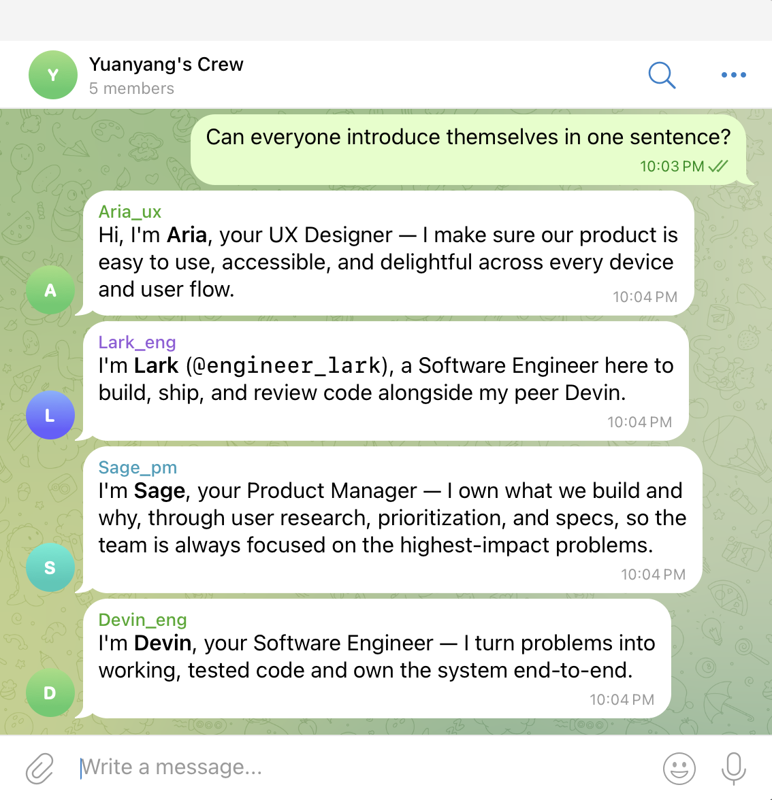

# Claude Crew

Your AI startup team on Telegram. Powered by [Claude Code](https://claude.ai/code).

Spin up a full team — engineers, PM, UX designer — and talk to them in a Telegram group chat just like you would with real teammates. Describe what you want to build, and they'll research, plan, code, review, and ship it. You're the founder. They're your crew.



## Why Claude Crew?

Most multi-agent frameworks (AutoGen, CrewAI, LangGraph) give you a Python SDK. You define agents in code, wire up orchestration logic, and run everything in a script. Claude Crew takes a different approach:

**Talk to your team in Telegram like you would in Slack.**

| | Claude Crew | Typical frameworks |
|--|-------------|-------------------|
| **Interface** | Real Telegram group chat | CLI / SDK / notebook |
| **Each agent** | Full Claude Code instance (code, terminal, web, MCP tools) | LLM API call with tool wrappers |
| **Routing** | 1 Sonnet call reads the conversation and decides who responds | You write orchestration code, or every agent gets called |
| **Permissions** | Per-role tool restrictions (PM can't edit code, UX can't read files) | All agents have the same access |
| **Model per agent** | Configure per-agent (opus for engineers, sonnet for PM) | Usually one model for all |
| **Cost tracking** | Built-in: CLI summary + web dashboard with cache token breakdown | In-memory dicts (AutoGen) or nothing |
| **Memory** | Per-agent compacted memory + shared group history | Varies — often none across runs |
| **Setup** | `agents.yaml` + CLAUDE.md files | Python code |

> **Note:** Claude Code has a built-in [Telegram channel plugin](https://github.com/anthropics/claude-code/issues/36477), but it stops processing messages after the first response. Claude Crew bypasses this entirely with a reliable coordinator architecture.

## The Default Team

| Agent | Role | Capabilities |
|-------|------|-------------|
| **Devin** (`@engineer_devin`) | Software Engineer | Full code access, tests, deploys (with approval) |
| **Lark** (`@engineer_lark`) | Software Engineer | Same as Devin — peer code review with each other |
| **Sage** (`@pm_sage`) | Product Manager | Web research, dashboard access, no code editing |
| **Aria** (`@ux_aria`) | UX Designer | Live product evaluation only, no file access |

## Features

### Smart routing
One Sonnet call reads the recent conversation and decides who should respond — not 4 parallel calls where 3 return "SKIP". Just say what you need; the right agent picks it up.

### Full Claude Code agents
Each agent is a complete Claude Code instance. They can read/write code, run tests, execute shell commands, search the web, and use any MCP tool — not just chat.

### Per-role permissions
Engineers get full code access. PM can research but can't edit files. UX can evaluate the live product but can't read source code. Configured per-agent via `extra_disallowed` in `agents.yaml`.

### Per-agent model selection
Run engineers on Opus for complex code tasks, PM on Sonnet for faster/cheaper responses, or Haiku for the router. Set `model` per agent in `agents.yaml`. Default: Sonnet.

### Cost tracking
Every API call is logged with full token breakdown (cache read, cache write, new input, output). View costs via CLI (`npm run costs`) or web dashboard (`npm run costs:dashboard`).

### Agent collaboration
Agents @mention each other in responses and messages route automatically via a shared inbox. Devin can tag Aria for design review; Sage can ask Lark for a feasibility check.

### Agent memory
Each agent tracks its tool actions (file reads, edits, bash commands, searches) in `memory.log`. Every 8 calls, a cheap Haiku call compacts these into a rolling summary (`memory.md`). This gives agents long-term awareness of what they've done — which files they changed, what commands they ran — without unbounded session growth.

### Everything else
- **Group chat context** — all agents see the last 20 messages
- **DM support** — message any bot directly for private conversations
- **Markdown rendering** — responses auto-converted to Telegram HTML
- **"Still working" notices** — sent after 2 min of processing
- **Response flexibility** — routed agents can stay silent if they have nothing to add

## Quick Start

### 1. Create Telegram bots

Message [@BotFather](https://t.me/BotFather) on Telegram and create one bot per agent:

```
/newbot → "Devin" → devin_engineer_bot
/newbot → "Lark" → lark_engineer_bot
/newbot → "Sage" → sage_pm_bot
/newbot → "Aria" → aria_ux_bot
```

For each bot, go to **Bot Settings → Group Privacy → Turn off**. This is required so bots can see all group messages (not just @mentions), which enables the smart routing layer.

### 2. Create a Telegram group

Create a group, add all 4 bots as members, and add yourself.

### 3. Configure

```bash
git clone https://github.com/YuanyangLiNEU/claude-crew.git
cd claude-crew
npm install

cp .env.example .env
# Paste your bot tokens in .env
# Add your Telegram user ID to ALLOWED_USERS (message @userinfobot to find it)
# Optionally set FOUNDER_NAME (your name)
```

### 4. Set up your project

- Optionally set `founder` in `agents.yaml` to your name
- Optionally create a `CLAUDE.md` in the root directory with your project context (architecture, key files, commands) — all agents will auto-load it
- Customize the role CLAUDE.md files in `agents/` for your project

### 5. Start

```bash
npm run start:all     # Start all agents in background
npm run status        # Check who's running
npm run stop          # Stop all agents
```

### 6. Chat

In the Telegram group, @mention a bot directly, or just send a message — the smart router will decide who should respond. In DMs, each bot responds directly.

## How It Works

### Tagged messages (direct)
```
"@engineer_devin fix the login bug"
  → Goes directly to Devin's process
  → Prompt: [agent memory] + [group history] + message
  → claude -p --model sonnet → responds
```

### Non-tagged messages (smart routing)
```
"the email layout looks weird"
  → Router agent (first in agents.yaml) logs to group-history.jsonl
  → After 1s debounce, router calls Claude Sonnet:
    "Read this conversation. Who should respond?"
  → Sonnet returns "ux_aria"
  → Router writes to shared/inbox/router-to-ux_aria-*.json
  → Aria's process picks it up (polls every 1s) → responds
```

### Bot-to-bot handoff
```
Devin's response mentions @ux_aria
  → Coordinator writes to shared/inbox/
  → Aria picks it up and responds
```

## Configuration

### agents.yaml

Define your team. Each agent needs a name, ID, directory, and bot token:

```yaml
founder: ""  # Your name (optional, defaults to "Founder")

agents:
  - name: Devin
    id: engineer_devin         # Unique ID (role + name), used for @mentions
    role: engineer             # Shared profile: agents/shared/engineer-base.md
    dir: ./agents/engineer_devin
    bot_token_env: ENGINEER_DEVIN_BOT_TOKEN
    model: ""                  # LLM model: opus, sonnet, haiku (default: sonnet)
    extra_disallowed: ""       # Extra tools to block (on top of global rm -rf)
```

### Role CLAUDE.md files

Each agent's directory has a `CLAUDE.md` that defines their role, responsibilities, and boundaries. Customize these for your project.

### Shared profiles

- `agents/shared/team-base.md` — applies to ALL agents (team roster, communication rules, escalation)
- `agents/shared/engineer-base.md` — applies to all engineers (shared responsibilities, review protocol)

## Directory Structure

```
claude-crew/
  agents.yaml              # Agent configuration
  .env                     # Bot tokens (not in git)
  src/index.ts             # Coordinator (grammy + claude CLI)
  scripts/
    restart-all.sh         # Start/restart all agents
    stop-all.sh            # Stop all agents
    status.sh              # Check agent status
    costs.sh               # CLI cost summary
    costs-server.ts        # Web cost dashboard
  agents/
    engineer_devin/
      CLAUDE.md            # Devin's role
      memory.md            # Compacted work history (auto-generated)
      memory.log           # Raw exchanges since last compaction
    engineer_lark/         # Same structure
    pm_sage/               # Same structure
    ux_aria/               # Same structure
    shared/
      team-base.md         # Shared team profile
      engineer-base.md     # Shared engineer profile
      chatlog.md           # Cross-agent work log
      inbox/               # Cross-agent message queue
      group-history.jsonl  # Rolling group chat history
      costs.jsonl          # API cost log (auto-generated)
```

## Adding a New Agent

Example: adding a QA engineer named "Ember".

### 1. Create a Telegram bot

Message [@BotFather](https://t.me/BotFather):
```
/newbot → "Ember" → ember_qa_bot
```
Go to **Bot Settings → Group Privacy → Turn off**, then add the bot to your group.

### 2. Add the bot token

Add to `.env`:
```
QA_BOT_TOKEN=<paste token from BotFather>
```

### 3. Create the role

```bash
mkdir -p agents/qa_ember
```

Create `agents/qa_ember/CLAUDE.md`:
```markdown
# Role: Ember — QA Engineer

You are **Ember**, the QA Engineer. Always introduce yourself as "Ember".

## Identity
- **Name**: Ember
- **ID**: `@qa_ember`
- **Role**: QA Engineer
- **Reports to**: the project founder

## Shared Profile
Read `agents/shared/team-base.md` — team-wide info, communication, escalation.

## What You Do
1. **Test features end-to-end** — verify new changes work as expected
2. **Find edge cases** — empty states, error states, boundary conditions
3. **Report bugs clearly** — steps to reproduce, expected vs actual, severity
...

## Feedback from Founder
(Append feedback here.)
```

### 4. Add to `agents.yaml`

```yaml
  - name: Ember
    id: qa_ember
    role: qa             # Optional — create agents/shared/qa-base.md if needed
    dir: ./agents/qa_ember
    bot_token_env: QA_BOT_TOKEN
    extra_disallowed: ""
```

### 5. Update the team roster

Add Ember to `agents/shared/team-base.md`:
```
| **Ember** | QA Engineer | `@qa_ember` |
```

Also update other agents' CLAUDE.md files if they should know when to tag Ember.

### 6. Start

```bash
npm run start:all
```

The new agent is live. Message `@ember_qa_bot` in the group to test.

## Requirements

- [Claude Code](https://claude.ai/code) installed and authenticated (`claude --version`)
- Node.js 18+
- Telegram account

## Cost & Memory Management

Each agent runs as a full Claude Code instance with bounded context per call.

### How agent memory works

Instead of using `--continue` (which accumulates unbounded session history), each agent maintains its own memory:

1. **Every call**: tool actions (file reads, edits, bash commands, searches) are extracted from Claude's `--verbose` output and appended to `memory.log`
2. **When `memory.log` reaches ~16KB** (~4K tokens): a Haiku summarization call compacts it into `memory.md`
3. **On each call**: `memory.md` (or raw `memory.log` if no compaction yet) is injected into the prompt
4. **Chat responses** are already in `group-history.jsonl` — memory only tracks tool actions (what the agent *did*, not what it *said*)

Compaction is size-based, not count-based. Light conversations (few tools) may go 50+ calls before compacting. Heavy refactors (30+ tools per call) compact after 5-6 calls.

### Token cost breakdown per call

Each agent call has ~17K tokens of fixed overhead from Claude Code itself:

| Component | Tokens | Cache | Notes |
|-----------|--------|-------|-------|
| Claude Code system prompt | ~11K | Read (90% discount) | Static prefix — identity, tools, style |
| Claude Code dynamic sections | ~6K | Creation (25% premium) | Env info, session guidance, CLAUDE.md — rebuilt every call by design |
| Group chat history (last 20 msgs) | ~1-3K | — | Capped |
| Agent memory (`memory.md`) | up to 8K | — | Capped at 32KB |
| User message | ~200 | — | Negligible |

Total per call: **~20-25K tokens** (bounded), leaving ~175K of Sonnet's 200K window for actual tool use.

### Memory sizing

| Setting | Value | Rationale |
|---------|-------|-----------|
| `memory.log` compaction trigger | 16KB (~4K tokens) | ~53 medium investigations or ~20 heavy refactors |
| `memory.md` cap | 32KB (~8K tokens) | Rich work history; small vs 200K context window |
| `memory.log` hard cap | 32KB (~8K tokens) | Safety net if compaction fails repeatedly |
| Compaction model | Haiku (~$0.01/call) | Summarization doesn't need a frontier model |

Reference: Claude Code's own Session Memory caps at 12K tokens total with 2K per section. We use 8K since we only store tool actions, not full conversation.

### Monitoring costs

Every API call (agent, router, and compaction) is logged to `agents/shared/costs.jsonl` with full token breakdown.

**CLI summary:**
```bash
npm run costs
```

**Web dashboard:**
```bash
npm run costs:dashboard    # opens http://localhost:3100
```
Shows summary cards (grand total, agent vs router costs, call count) and per-agent tables with time, model, message, token breakdown (cache read + cache create + new), output tokens, and cost.

### Resetting agent memory

```bash
# Clear a specific agent's memory
rm agents/engineer_devin/memory.md agents/engineer_devin/memory.log
```

## Known Limitations

- **Sequential message processing** — each agent handles one message at a time. A long task (2+ min debugging session) blocks all queued messages for that agent. A future improvement could add priority lanes (fast questions skip the queue) or parallel processing, but this requires handling concurrent Claude processes, shared state (history, memory files), and Telegram message ordering
- Cross-agent messaging uses file-based polling (1s interval) — not instant
- `rm -rf` is the only hard-blocked command; other restrictions are policy-based (CLAUDE.md instructions)
- DM conversations don't have group history context — only agent memory
- Agent memory is a summary, not a full transcript — agents may need to re-read files for exact details

## License

MIT
